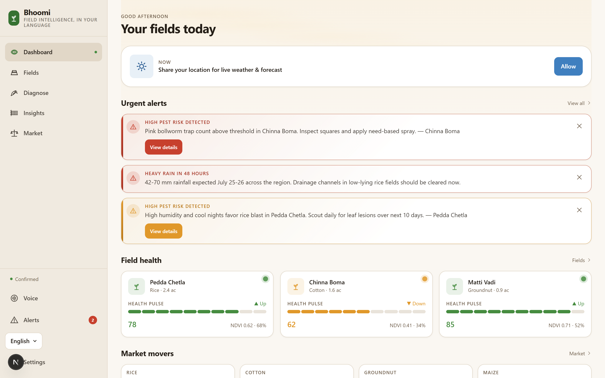
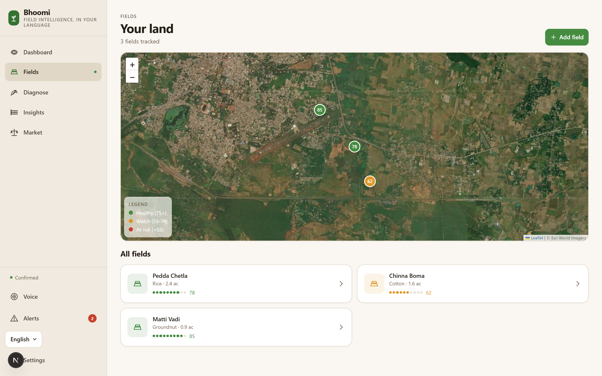
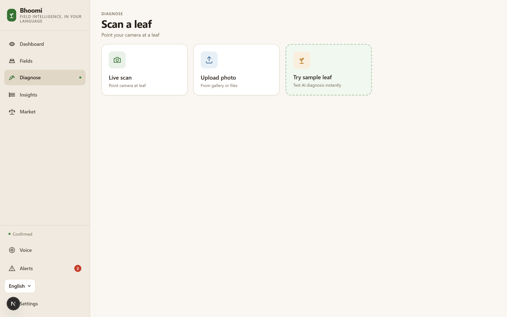
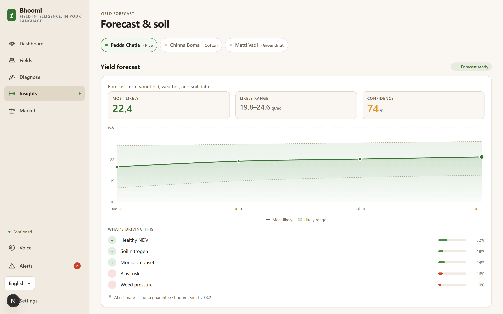
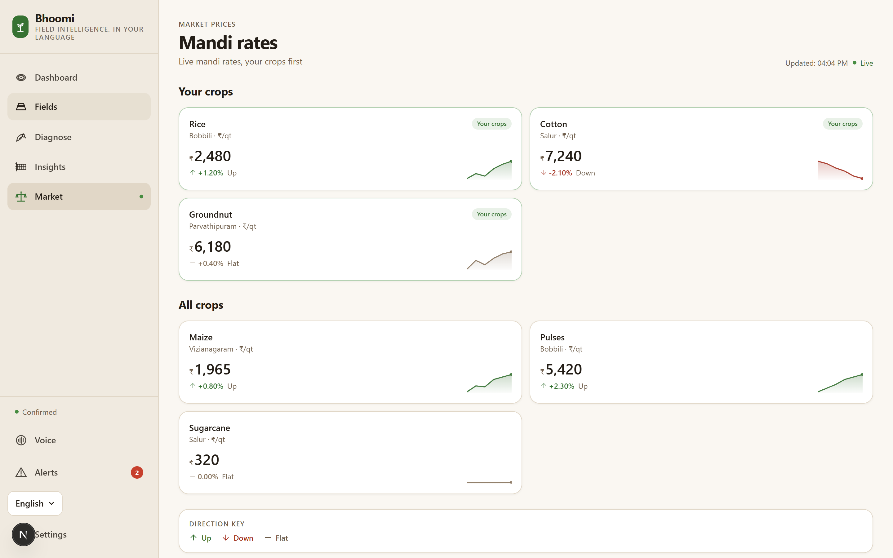

<div align="center">
  

  # Bhoomi AI

  **Next-Generation Field Intelligence & AI Agronomy for Modern Farmers**

  [](https://nextjs.org/)
  [](https://tailwindcss.com/)
  [](https://ai.google.dev/)
  [](https://www.typescriptlang.org/)

  *Empowering precision agriculture with real-time analytics, machine learning, and intuitive design.*
</div>

---

<div align="center">
  
</div>

<br/>

Bhoomi is a premium, AI-powered agricultural intelligence platform designed to bridge the gap between traditional farming and modern data science. By leveraging state-of-the-art vision models and localized agronomic data, Bhoomi delivers precision insights directly to the farmer.

## ✨ Premium Features

- 🌾 **Yield Forecasting & Analytics** — Harness local environmental datasets, soil health indicators, and crop stages to predict harvests with high accuracy.
- 🔬 **AI-Powered Diagnostics** — Instant, real-time disease and pest identification using Gemini Vision models. Snap a picture of a leaf and receive localized, actionable treatments.
- 🌱 **Intelligent Soil Management** — Input NPK and pH levels to receive tailored, dynamically generated crop suitability matrices and fertilizer regimens.
- 🎙️ **Multilingual Voice Assistant** — Speak directly to the platform in English, Hindi, Odia, or Telugu. Natural language processing instantly translates and answers complex agricultural queries.
- 📱 **Seamless UX & Micro-interactions** — Built with a stunning dark mode aesthetic, smooth transitions, and high-performance tactile feedback.

---

## 🎨 Visual Showcase

Experience the sleek, modern interface of Bhoomi AI.

<table align="center" style="border-collapse: collapse; border: none; width: 100%;">
  <tr>
    <td align="center" width="50%" style="border: none; padding: 10px;">
      <b>Global Dashboard</b><br/>
      
    </td>
    <td align="center" width="50%" style="border: none; padding: 10px;">
      <b>Field Tracking</b><br/>
      
    </td>
  </tr>
  <tr>
    <td align="center" width="50%" style="border: none; padding: 10px;">
      <b>AI Disease Diagnosis</b><br/>
      
    </td>
    <td align="center" width="50%" style="border: none; padding: 10px;">
      <b>Agronomic Insights</b><br/>
      
    </td>
  </tr>
  <tr>
    <td align="center" width="100%" colspan="2" style="border: none; padding: 10px;">
      <b>Live Market Prices</b><br/>
      
    </td>
  </tr>
</table>

---

## 🏗️ Architecture

Bhoomi relies on a scalable, serverless architecture utilizing the **Google Gemini API** for core intelligent features:
* **Computer Vision**: Gemini 1.5 Flash processes localized crop images with minimal latency.
* **LLM Engine**: Advanced prompt engineering processes localized contexts (weather, soil, voice inputs) to structure complex JSON agronomy plans.
* **UI/UX**: Radix primitives paired with Tailwind CSS for high-performance, accessible components.

## 🚀 Getting Started

Ensure you have Node.js 18+ and a valid Gemini API key.

```bash
# Clone and install dependencies
npm install

# Setup environment variables
echo "GEMINI_API_KEY=your_key_here" > .env.local

# Launch the platform
npm run dev
```

Platform boots up immediately at [http://localhost:3000](http://localhost:3000).

---

<div align="center">
  <sub>Engineered with precision for the future of agriculture.</sub>
</div>
